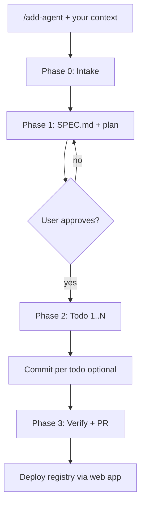

# Agent implementation workflow

End-to-end flow for adding a new agent: **context → SPEC → plan → approve →
build in todos → commit per todo → verify → ship**.

Use with `/add-agent` (Cursor) and [SKILL.md](../SKILL.md) (mechanical checklist).

## Overview



## Phase 0 — Context intake

**Goal:** Capture everything the user knows before scoping.

Ask for (or read from the user's message):

| Field | Examples |
|-------|----------|
| Agent idea / job | "Map and scrape sites into JSON" |
| Lane | Web, Files, Channels |
| Primary provider | Firecrawl, Telegram, Exa, etc. |
| API docs / SDK | link or package name |
| Prototype | `tmp/firecrawl-migrator`, GitHub URL |
| Must-have tools | "map + batch scrape + save" |
| Env vars user has | `FIRECRAWL_API_KEY`, … |
| Out of scope | scheduling UI, CMS export, 10 tools |
| E2E in template? | yes / no |

If context is thin, ask targeted questions — do not guess providers.

## Phase 1 — Plan (no tool code yet)

1. Read [agent-foundation-strategy.md](agent-foundation-strategy.md).
2. Fill [agent-spec-template.md](agent-spec-template.md) → write
   `ai/agents/<short>/SPEC.md` with `Status: draft`.
3. Present the **Implementation plan** table from the SPEC in chat.
4. Give recommendation: **proceed** | **narrow scope** | **extend existing agent**.

**Stop here** until the user says **approve**, **go ahead**, or **implement**.

Commit todo 0 only when user wants commits:

```bash
docs(agent): add <short>-agent spec
```

## Phase 2 — Build (one todo at a time)

Follow todos in SPEC **in order**. After each todo:

1. Run the **Verify before commit** command from the plan row.
2. Mark the todo done in chat (and update SPEC acceptance criteria as you go).
3. If user asked for **commit-per-step**, create **one commit** with the message
   from the plan row. Never batch unrelated todos into one commit.

### Standard todo order (matches extraction-agent history)

| # | What ships | Typical commit |
|---|------------|----------------|
| 1 | `ai/agents/<short>/` source + `data/<short>-agent.local/` | `feat(agent): add <short>-agent source for …` |
| 2 | `ai/agents/<short>/test/` | `test(agent): add <short>-agent tests` |
| 3 | `registry/registry-agents.ts` + `pnpm agentcn:registry:build` | `feat(registry): register <short>-agent` |
| 4 | MDX + demo + `meta.json` | `docs(agent): add <short>-agent docs and demo` |
| 5 | typecheck + build + registry verify | `chore(agent): verify <short>-agent build` |
| 6 | (optional) `examples/agent-ui-template/` | `feat(examples): wire <short>-agent in agent-ui-template` |

Reference: extraction-agent commits `c10cbea` → `21c3d77` → `d288a56` → `330c3fa`.

### Commit rules

- **Conventional commits:** `feat`, `test`, `docs`, `chore`, `feat(registry)`, `feat(examples)`.
- **One concern per commit** — source separate from registry separate from docs.
- **Only commit when the user asks** (default). If they say "commit each step" or
  "commit as you go", commit after every todo.
- **Commit message = plan row** — keeps git log aligned with SPEC traceability.
- Do not amend unless user rules allow; failed hooks → new commit.

### During implementation

- If scope drifts, **update SPEC.md** in the same PR before merging.
- Set `Status: approved` at start of Phase 2; `Status: implemented` when done.
- Use the build skill phases for file-level detail:
  [agent-anatomy.md](agent-anatomy.md),
  [registry-cli-prod.md](registry-cli-prod.md),
  [docs-and-demo.md](docs-and-demo.md).

## Phase 3 — Verify and ship

Before PR:

- [ ] All SPEC acceptance criteria checked
- [ ] `pnpm jest ai/agents/<short>`
- [ ] `pnpm agentcn:registry:build`
- [ ] `pnpm exec nx run @kit/web:typecheck`
- [ ] `pnpm deploy:build`
- [ ] Optional: `npx agentcn@latest add <short>-agent --dry-run` in a temp dir

PR: use `/pr-description`. Link SPEC in PR body ("implements `ai/agents/<short>/SPEC.md`").

**Production:** merge + deploy web app so `https://agentcn.dev/r/<short>-agent.json` is live.

## Quick reference for users

**Start a new agent:**

```
/add-agent

Provider: Firecrawl
Prototype: tmp/firecrawl-migrator
Job: map a site and batch-scrape to JSON in workspace
Must-have: map_site, batch_scrape, save_results
Out of scope: wizard UI, ecommerce-specific agent
Commit: each step
E2E template: yes
```

**Approve plan:**

```
approve — implement with commit each step
```

## When NOT to use full workflow

| Change | Workflow |
|--------|----------|
| New registry agent | Full workflow + SPEC.md |
| Add one tool to existing agent | Update agent docs + PR; no new SPEC |
| Docs-only fix | Direct edit |
| Registry env var tweak | Single commit; note in PR |
