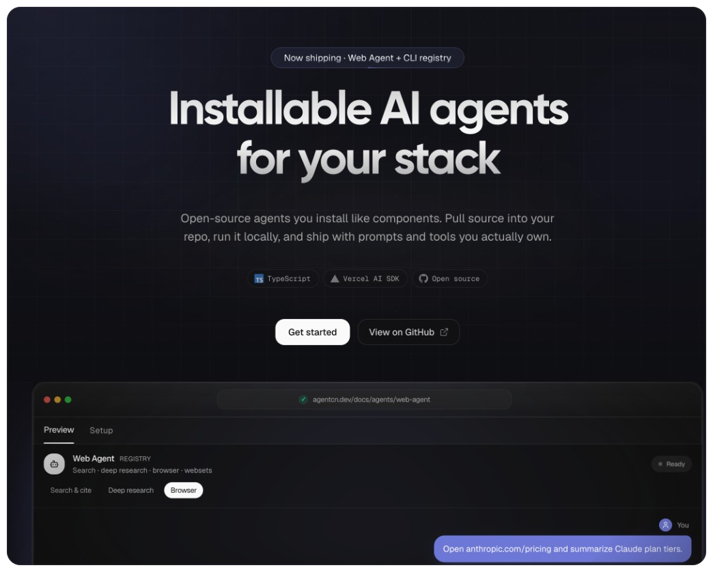

# AgentCN

**Installable AI agents for your stack.**

Add an agent with one CLI command. Source lands in your repo as real TypeScript — prompts, tools, and runtime you can edit and own.

<p align="center">
  
</p>

<p align="center">
  <a href="https://agentcn.dev/docs"><strong>Docs</strong></a>
  ·
  <a href="https://agentcn.dev/r"><strong>Registry</strong></a>
  ·
  <a href="https://www.npmjs.com/package/agentcn"><strong>npm</strong></a>
  ·
  <a href="https://github.com/anayatkhan1/kit"><strong>GitHub</strong></a>
</p>

```bash
npx agentcn@latest add web-agent
```

---

## Why AgentCN?

Most AI kits ship opaque SDKs. AgentCN ships **agents you install like components**:

| What you get | Why it matters |
| --- | --- |
| **CLI install** | `npx agentcn add <agent>` pulls files into your project |
| **Hosted registry** | Manifests at [agentcn.dev/r](https://agentcn.dev/r) (local override for dev) |
| **Editable source** | Real TypeScript under `ai/agents/` — change prompts and tools |
| **Docs + demos** | Guides and simulated previews on [agentcn.dev](https://agentcn.dev) |

Built on the [Vercel AI SDK](https://sdk.vercel.ai/), TypeScript, and Anthropic Claude.

---

Agents include web, extraction, and ecommerce — run `npx agentcn@latest list` or see the [docs](https://agentcn.dev/docs).

---

## Quick start

**1. Install an agent into your app**

```bash
pnpm dlx agentcn@latest add web-agent
# or
npx agentcn@latest add web-agent
# yarn / bun also work
```

**2. Set API keys** (agent-specific — see docs)

```env
ANTHROPIC_API_KEY=...
# Web Agent also needs:
# EXA_API_KEY=...
# ANCHOR_API_KEY=...
```

**3. Call the agent from your code**

After install, import from the generated path (typically `ai/agents/<name>`). Full wiring guides:

- [Web Agent](https://agentcn.dev/docs/agents/web-agent)
- [Extraction Agent](https://agentcn.dev/docs/agents/extraction-agent)
- [Ecommerce Agent](https://agentcn.dev/docs/agents/ecommerce-agent)

Useful flags:

```bash
npx agentcn@latest add web-agent --dry-run   # preview files
npx agentcn@latest add web-agent --yes       # skip prompts
```

---

## Develop this monorepo

### Prerequisites

- Node.js 20+ (18+ may work)
- pnpm 9+
- Anthropic API key (to run agents locally)

### Install

```bash
git clone https://github.com/anayatkhan1/kit.git
cd kit
pnpm install
```

### Docs / marketing site

```bash
cp apps/web/.env.example apps/web/.env
pnpm web
```

Open [http://localhost:3000](http://localhost:3000).

`apps/web/.env`:

```env
# Local
NEXT_PUBLIC_APP_URL=http://localhost:3000

# Production should match the host that serves 200 without redirect
# NEXT_PUBLIC_APP_URL=https://www.agentcn.dev
```

### Live agent UI (optional)

Docs pages use simulated demos. For real runs with your keys:

```bash
cd examples/agent-ui-template
pnpm install
pnpm dev:embed    # http://localhost:3001
```

### Production build

```bash
pnpm deploy:build   # registry JSON + Next.js build for @kit/web
```

### Local registry (CLI against this repo)

```bash
pnpm agentcn:registry:build
npx agentcn@latest list -r ./apps/web/public/r
npx agentcn@latest add web-agent -r ./apps/web/public/r --dry-run --yes
```

### Common commands

| Task | Command |
| --- | --- |
| Docs dev server | `pnpm web` |
| Docs production build | `pnpm web:build` |
| Build agent registry | `pnpm agentcn:registry:build` |
| Build CLI | `pnpm agentcn:build` |
| Test web agent | `pnpm test:web-agent` |
| Test extraction agent | `pnpm test:extraction-agent` |
| Test ecommerce agent | `pnpm test:ecommerce-agent` |
| Verify live registry | `pnpm agentcn:registry:verify-live` |

```bash
pnpm nx show projects
pnpm nx show project agentcn --json
```

---

## Project structure

```text
kit/
├── ai/agents/
│   ├── web/              # Web Agent
│   ├── extraction/       # Extraction Agent
│   └── ecommerce/        # Ecommerce Agent
├── apps/web/             # agentcn.dev — docs, registry host, marketing
│   ├── content/docs/     # MDX documentation
│   └── public/r/         # Generated agent registry JSON
├── packages/agentcn/cli/ # `agentcn` npm package
├── examples/
│   └── agent-ui-template/  # Local embed UI for live agent testing
├── registry/             # Registry declarations (source of manifests)
└── scripts/              # Registry build & verify helpers
```

**Flow:** agent source in `ai/agents/` → registry build → `apps/web/public/r/<agent>.json` → `npx agentcn add` installs into a consumer repo.

---

## Environment variables

**Repo root** (running agents / tests):

```env
ANTHROPIC_API_KEY=your_anthropic_api_key
AGENTCN_REGISTRY_URL=https://agentcn.dev/r   # optional override
```

**Keys by agent**

| Agent | Required |
| --- | --- |
| Web | `ANTHROPIC_API_KEY`, `EXA_API_KEY`, `ANCHOR_API_KEY` |
| Extraction | `ANTHROPIC_API_KEY` |
| Ecommerce | `ANTHROPIC_API_KEY`, `FIRECRAWL_API_KEY` |

Get an Anthropic key: [console.anthropic.com](https://console.anthropic.com/)

---

## Releasing the CLI

The `agentcn` package uses [Nx release](https://nx.dev/features/manage-releases) and conventional commits.

```bash
pnpm release --dry-run --skip-publish
pnpm release
```

Maintainer notes: [`packages/agentcn/cli/RELEASE.md`](packages/agentcn/cli/RELEASE.md)

---

## Contributing

1. Fork and clone.
2. Branch: `git checkout -b feat/your-feature-name`
3. Test locally (`pnpm test:web-agent`, `pnpm web:build`, etc.).
4. Commit with [Conventional Commits](https://www.conventionalcommits.org/) (`feat:`, `fix:`, `docs:`, …).
5. Open a PR against `main`.

Ideas and bugs: [Discussions](https://github.com/anayatkhan1/kit/discussions) · [Issues](https://github.com/anayatkhan1/kit/issues)

Match existing TypeScript style. In `apps/web`: `pnpm web:format:check`.

---

## License

MIT with an additional clause restricting resale of unmodified or minimally modified versions. See [LICENSE](./LICENSE).

---

Built by [Anayat Khan](https://anayat.xyz) · [agentcn.dev](https://agentcn.dev)
